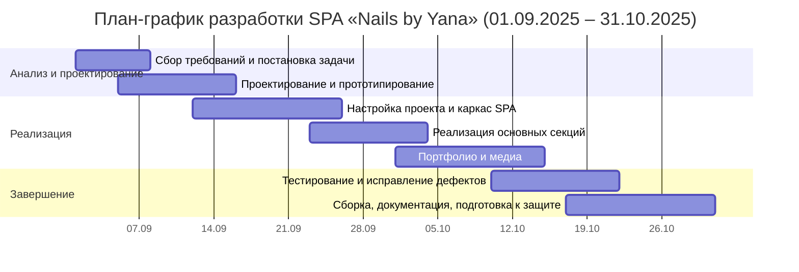

# Календарный план разработки (2 месяца после утверждения ТЗ)

**Период:** 01.09.2025 — 31.10.2025 (календарных два месяца).  
**Условная интенсивность:** ~4 ч/рабочий день в среднем; этапы частично **перекрываются** (как в реальной разработке).

## Таблица 4 — план-график работ (трудозатраты в часах)

| № | Наименование этапа | Содержание работ | Дата начала | Дата окончания | Длительность (ч) |
|---|---------------------|------------------|-------------|----------------|------------------|
| 1 | Сбор требований и постановка задачи | Интервью с заказчиком; состав секций и внешних сервисов; запись через Dikidi | 01.09.2025 | 08.09.2025 | 24 |
| 2 | Проектирование и прототипирование | Mind map, use case; wireframe и макет в Figma; архитектура статического SPA; обоснование без СУБД | 05.09.2025 | 16.09.2025 | 40 |
| 3 | Настройка проекта и каркас SPA | Vite + React + TypeScript; маршруты `/` и `*`; Tailwind, shadcn/ui; Header, Hero, базовый Footer | 12.09.2025 | 26.09.2025 | 64 |
| 4 | Реализация основных секций | About, Services (карточки, цены, CTA), Reviews, Certificates; контакты и копирование телефона | 23.09.2025 | 04.10.2025 | 40 |
| 5 | Портфолио и медиа | Каталоги blok1–blok4, `import.meta.glob`, `loading="lazy"`; видео-отзывы; адаптив, мобильное меню | 01.10.2025 | 15.10.2025 | 48 |
| 6 | Тестирование и исправление дефектов | Ручное функциональное и кросс-браузерное тестирование; доработки по результатам | 10.10.2025 | 22.10.2025 | 40 |
| 7 | Сборка, документация, подготовка к защите | `npm run build`, проверка `dist`; README; скриншоты; согласование с заказчиком | 17.10.2025 | 31.10.2025 | 56 |

**Итого трудозатраты:** **312 ч** (~39 восьмичасовых рабочих дней при последовательном учёте; по календарю — два месяца за счёт параллельных работ и неполной занятости отдельных дней).

---

## Диаграмма Ганта (Mermaid)

Вставьте блок в Markdown (GitHub, VS Code с Mermaid) или откройте на [mermaid.live](https://mermaid.live) для экспорта в PNG/SVG.

